<h1 align="center"> Time Bank </h1>  

## 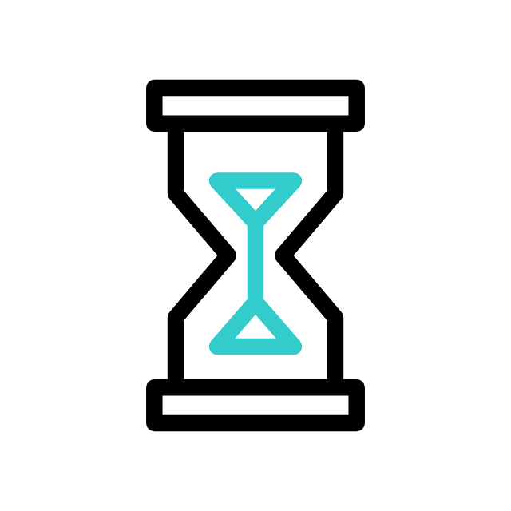 What is a time bank?
It is in it's name, a bank where the only currency is time! Namely, it is a reciprocity-based work trading system in which hours are the currency. With time banking, a person with one skill set can bank and trade hours of work for equal hours of work in another skill set instead of paying or being paid for services. In addition, the hours banked are always traded equally regardless of the services rendered. This equality is intended to foster ties in communities and, by making all contributions valued equally, encourage equality in the communities themselves.

##  What is the purpose of this website?
A time bank has always existed in theory; however, it has never been implemented... at least not as a social website. Hence, the purpose of this website is to bring life to the time bank by allowing users to create an account, post trades, see other trades that might be suitable for them and so on.

##  What are some sexy features used here?
1- Spotlight Effects  
2- Parallax Effects  
3- Dynamic Movements  
4- SEO  

##  What features to expect in the future?
1- Livechat (firebase)  
2- Google Maps / Location Sharing  
3- and more...  

##  Having a hard time getting started? Follow this simple tutorial:  

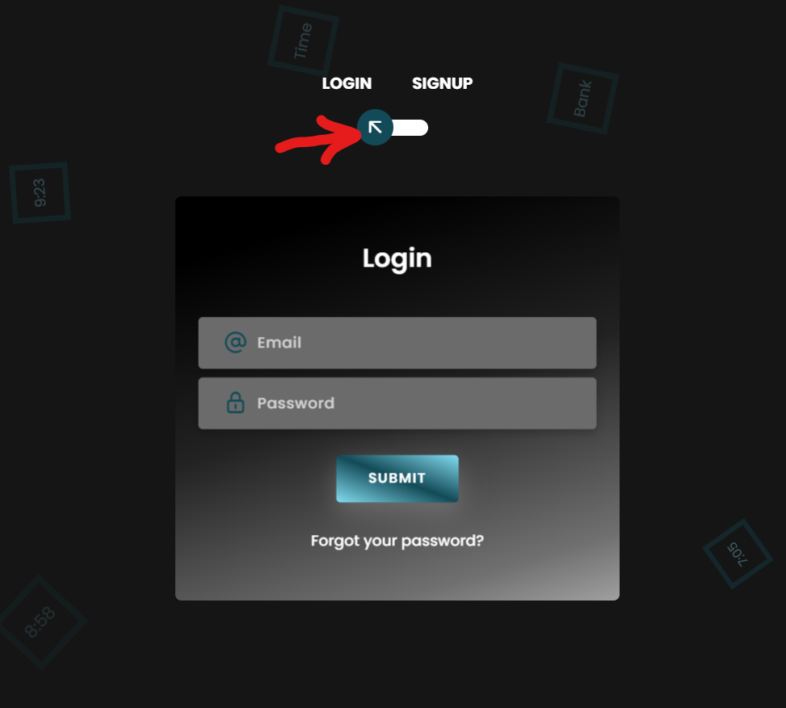
  

First and foremost, you need to create an account. To do so, you must click on the toggle button (look at the red arrow in the image above) to flip the login card to the sign up card.
  
  

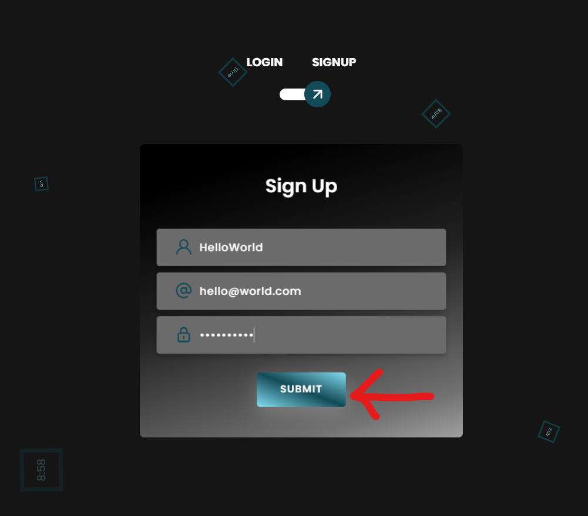
  

As soon as the card flips you will be able to fill out all the required information and then hit the submit button.  
Then, you will be sent back to the login side of the card to be able to login with your newly created account.  
Woohoo! (P.S. thanks for joining the platform)
  

   

You are then greeted with a beautiful Time Bank title.  
Now what? Well, here comes the fun part!  
You should now scroll down to view the posts, but while doing so you might notice some things moving around...IT IS A PARALLAX EFFECT!  
Double woohoo!
  

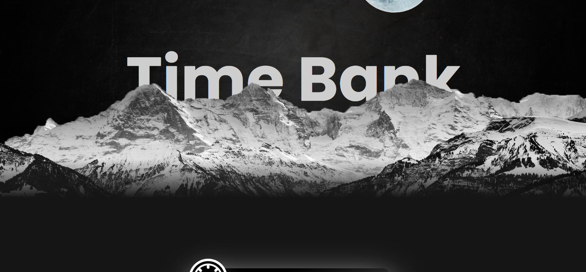
  

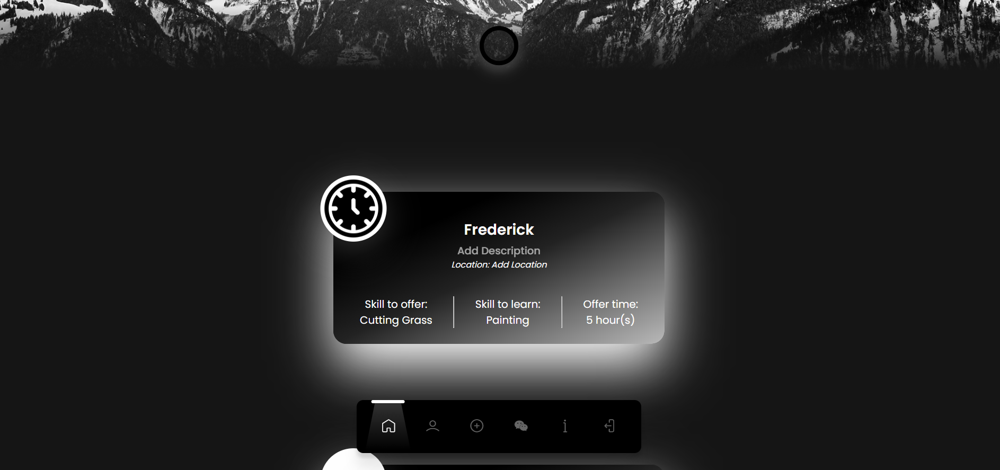
  

After scrolling for a bit, you will notice more things appear.
  

1) The search bar... what? where?? The glowing black circle at the top of the page!
  

2) The navigation bar. Yes, that bar with the spotlight.
  

3) Lastly, the first post of the feed! Triple woohoo!
  

Now, what happens if we click on that infamous glowing black orb?
  

  

Boom! You can now search for specific offers of interest rather than looking at all available options!  
What if you find an interesting post?  
Then simply hover over that post and a message button will pop up!
  

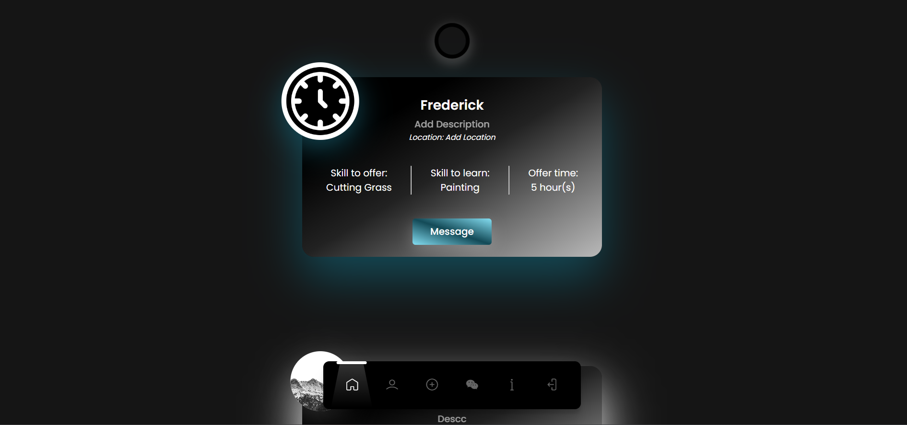
   

When clicked, you would be able to send private messages back and forth with the owner of that post... well not yet, as soon as it gets implementd! :)  
After browsing the feed for a while, you might want to take a look at your own profile.
  
  

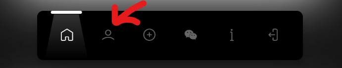
  

To do so, just click on the user icon on the navigation bar.
  

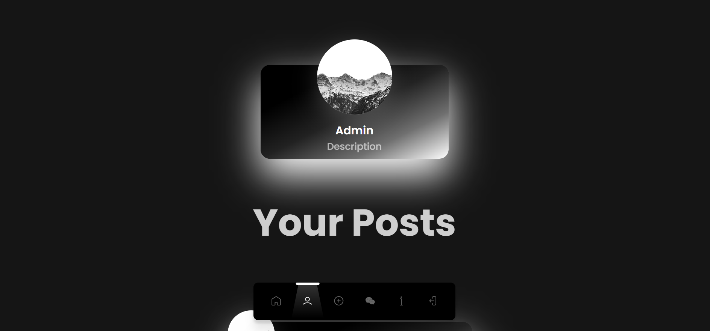
  

There you go! All your account details and posts will be displayed here.  
Hmm... but where can you see more & edit your profile?
  

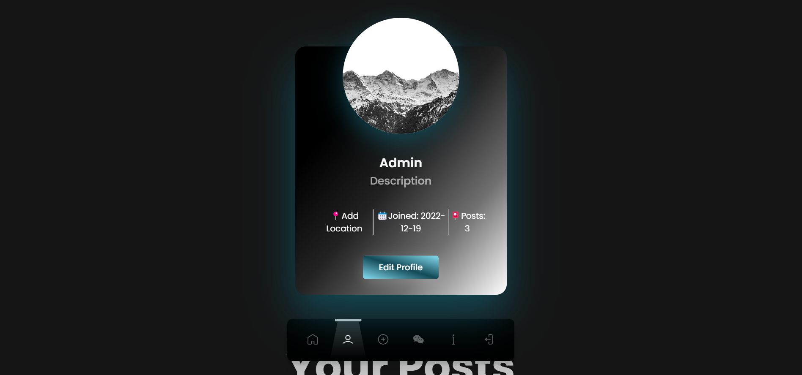
  
  

It is simple! Once again just hover over your profile card and eveything will appear!
  

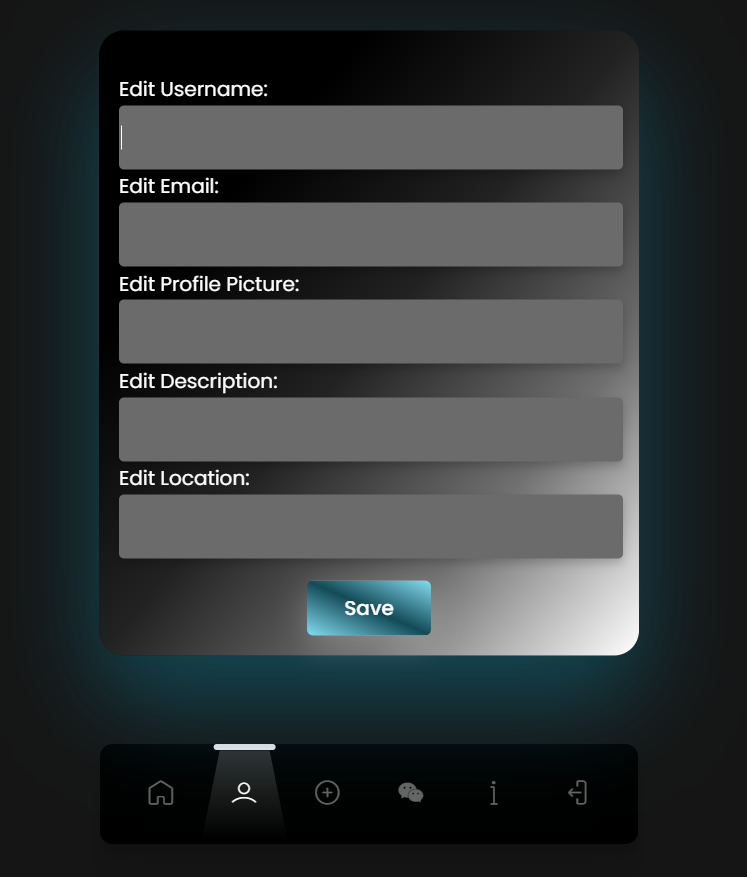
  

Pressing on the edit profile button will take you to a page where you will be able to edit your username, email, profile picture and more...
    

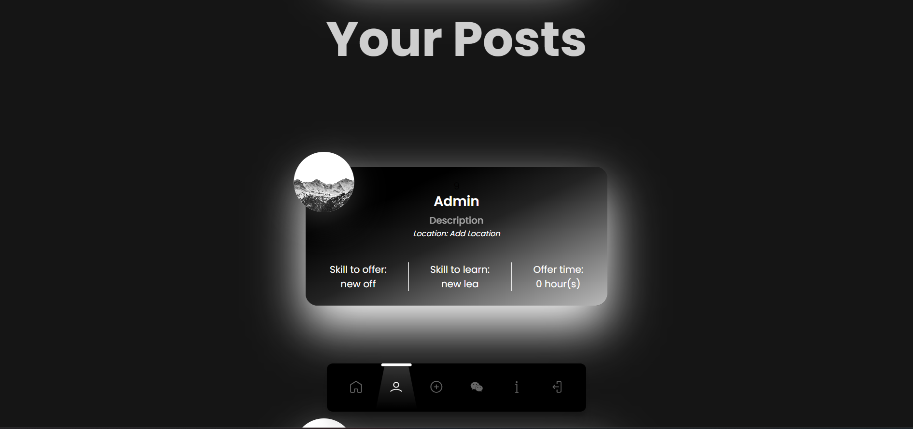
  

After saving your changes, you will be sent back to your profile.  
You may scroll down to see all the trades that you have posted.  
But let us say that you posted a cringy post (as most of us had at one point), and you may want to delete it. How?
  
  

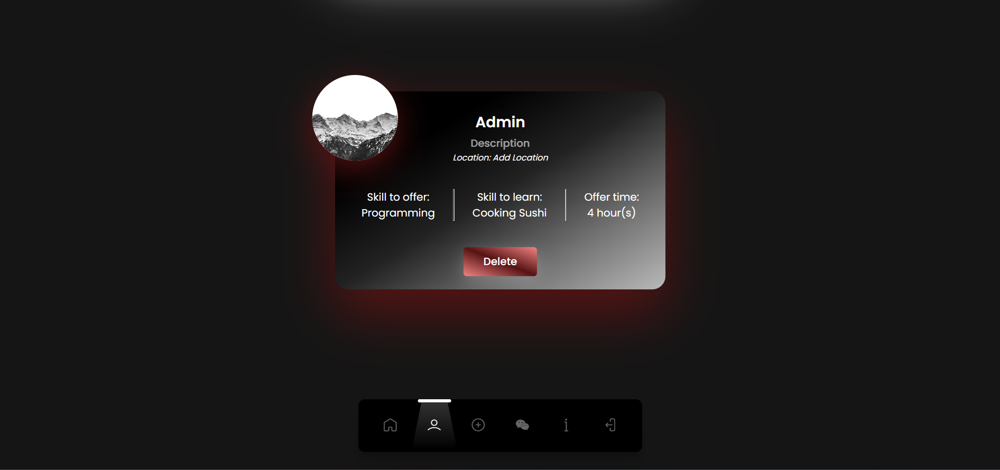
  

It is all about hovering! Move your cursor on to the post that you would like to delete and you will see a delete button pop up. (as well as a nice red color)
    

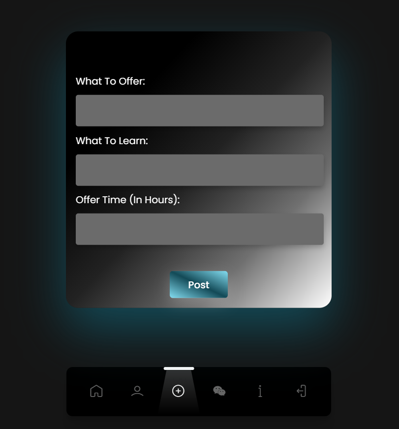
  

Moving on, you might want to post a trade. You can do so by clicking on the "+" icon near the center of your navigation bar. This will allow you to fill out the required fields and post your trade for others to see! Also, we might want to skip the message & about pages for now (they will be done soon! I promise!)
  

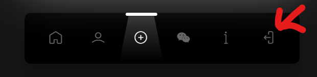
  

After a nice journey comes a little rest, so you might want to logout by pressing on the exit icon on your navigation bar.
  

<i><h3 align="center"> Thank you for visiting! </h3></i>
