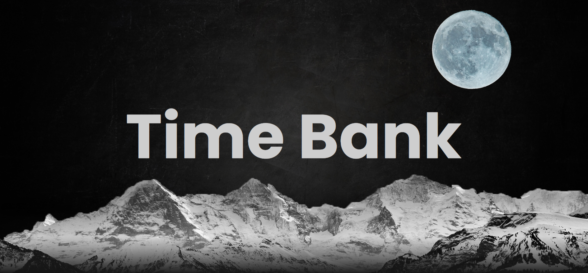

# Time Bank

## What is a time bank?
It is in it's name, a bank where the only currency is time! Namely, it is a reciprocity-based work trading system in which hours are the currency. With time banking, a person with one skill set can bank and trade hours of work for equal hours of work in another skill set instead of paying or being paid for services. In addition, the hours banked are always traded equally regardless of the services rendered. This equality is intended to foster ties in communities and, by making all contributions valued equally, encourage equality in the communities themselves.

## What is the purpose of this website?
A time bank has always existed in theory; however, it has never been implemented... at least not as a social website. Hence, the purpose of this website is to bring life to the time bank by allowing users to create an account, post trades, see other trades that might be suitable for them and so on.

## What are some sexy features used here?
1- Spotlight Effects  
2- Parallax Effects  
3- Dynamic Movements  
4- SEO  

## What features to expect in the future?
1- Livechat (firebase)  
2- Google Maps / Location Sharing  
3- and more...  

## Having a hard time getting started? Follow this simple tutorial:  
  

First and foremost, you need to create an account. To do so, you must click on the toggle button (look at the red arrow in the image above) to flip the login card to the sign up card.
  
  

As soon as the card flips you will be able to fill out all the required information and then hit the submit button.  
Then, you will be sent back to the login side of the card to be able to login with your newly created account.  
Woohoo! (P.S. thanks for joining the platform)

  

You are then greeted with a beautiful Time Bank title.  
Now what? Well, here comes the fun part!  
You should now scroll down to view the posts, but while doing so you might notice some things moving around...IT IS A PARALLAX EFFECT!  
Double woohoo!

 
